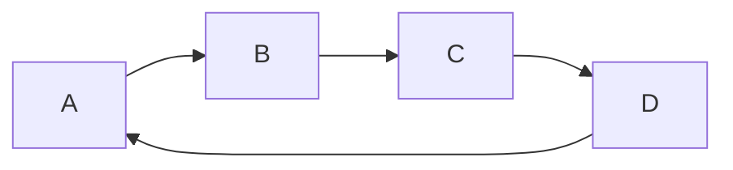

# 日志框架比较
## Log4j
Log4j是Apache的一个Java的日志库，通过使用Log4j，我们可以控制日志信息输送的目的地（控制台、文件、数据库等）；
我们也可以控制每一条日志的输出格式；通过定义每一条日志信息的级别，我们能够更加细致地控制日志的生成过程。

## Logback
Logback，一个“可靠、通用、快速而又灵活的Java日志框架”。logback当前分成三个模块：
logback-core，logback- classic和logback-access。logback-core是其它两个模块的基础模块。
logback-classic是log4j的一个改良版本。此外logback-classic完整实现SLF4J API使你可以很方便地更换成其它日志系统，
如log4j或JDK14 Logging。logback-access模块与Servlet容器（如Tomcat和Jetty）集成，以提供HTTP访问日志功能。
请注意，您可以在logback-core之上轻松构建自己的模块。

## Log4j2
Apache Log4j 2是对Log4j的升级，它比其前身Log4j 1.x提供了重大改进，并提供了Logback中可用的许多改进，同时修复了Logback架构中的一些问题。
现在最优秀的Java日志框架是Log4j2，没有之一。根据官方的测试表明，在多线程环境下，Log4j2的异步日志表现更加优秀。
在异步日志中，Log4j2使用独立的线程去执行I/O操作，可以极大地提升应用程序的性能。

## 性能比较
可见在同步日志模式下, Logback的性能是最糟糕的.
而log4j2的性能无论在同步日志模式还是异步日志模式下都是最佳的.
因在于log4j2使用了LMAX, 一个无锁的线程间通信库代替了, logback和log4j之前的队列. 并发性能大大提升。所以log4j2>log4j>logback

## SLF4J
SLF4J，即简单日志门面（Simple Logging Facade for Java），不是具体的日志解决方案，而是通过**Facade Pattern**提供一些Java logging API，
它只服务于各种各样的日志系统。按照官方的说法，SLF4J是一个用于日志系统的简单Facade，允许最终用户在部署其应用时使用其所希望的日志系统。
作者创建SLF4J的目的是为了替代Jakarta Commons-Logging。
实际上，SLF4J所提供的核心API是一些接口以及一个LoggerFactory的工厂类。在使用SLF4J的时候，
不需要在代码中或配置文件中指定你打算使用那个具体的日志系统。类似于Apache Common-Logging，
SLF4J是对不同日志框架提供的一个门面封装，可以在部署的时候不修改任何配置即可接入一种日志实现方案。
但是，他在编译时静态绑定真正的Log库。使用SLF4J时，如果你需要使用某一种日志实现，那么你必须选择正确的SLF4J的jar包的集合（各种桥接包）。
SLF4J提供了统一的记录日志的接口，只要按照其提供的方法记录即可，最终日志的格式、记录级别、输出方式等通过具体日志系统的配置来实现，
因此可以在应用中灵活切换日志系统。

